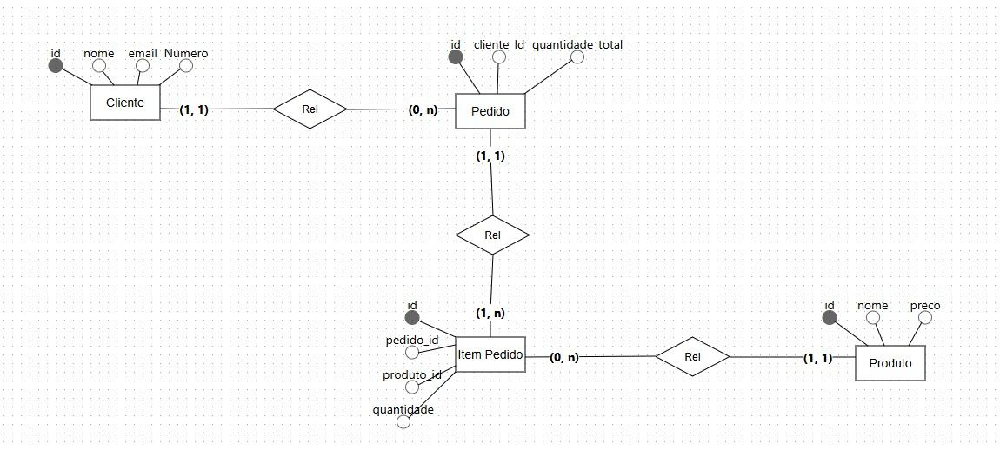
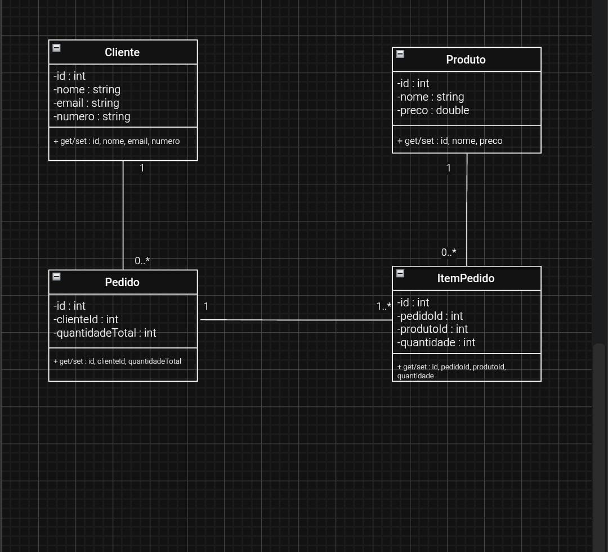

# 🛒 API REST de Ponto de Venda (PDV) em Spring Boot

API desenvolvida em **Java** com o framework **Spring Boot** para atuar como o *core* transacional de um sistema de Ponto de Venda. Implementa uma arquitetura RESTful para gerenciar de forma eficiente:
* **Cliente** (Cliente e Pedido)
* **Pedido** (Pedidos da Compra)
* **Itens do Pedido** (Composição dos itens do Pedidos )
* **Produto** (Produtos à venda)

## 🛠️ Como Executar

1.  **Clone o repositório:** `git clone https://github.com/Davison-foxx/Sistema_De_Gerenciamento_Cliente_Pedidos
2.  **Navegue até o diretório:** `cd nome-do-projeto`
3.  **Execute via Maven:** `./mvnw spring-boot:run`
4.  A API estará disponível em: **`http://localhost:8080`**

## 📘 Descrição e Objetivo do Projeto

O **objetivo real** deste projeto é ser o **motor operacional (backend)** para um **Ponto de Venda (PDV)** ou sistema de Caixa. A API oferece a base para que o **funcionário/operador** execute e gerencie as transações de venda.

| Área de Foco | Funcionalidade Operacional | Perspectiva do Operador/Caixa |
| :--- | :--- | :--- |
| **Abertura da Transação** | Iniciação da Venda |(nova venda) para o cliente que está sendo atendido. |
| **Processamento do Pedido** | Inserção e Modificação de Itens | O operador adiciona, remove e ajusta a **quantidade** de itens conforme o cliente dita, montando o pedido. |

## 📐 Arquitetura de Dados (Diagrama ER)
 

O projeto utiliza um design focado em entidades bem relacionadas:
Um **Cliente** pode realizar vários **pedidos** (representado pelo **0..***) . 
Mas um **Pedido** pertence obrigatoriamente a apenas um **cliente** (representado pelo **1**).

**Pedido** x **ItemPedido**
* Um **Pedido** é composto por vários itens de **pedido** (representado pelo **1.*** - indicando que o **pedido** não pode estar vazio). 
* Mas um **ItemPedido** (aquela linha específica da nota) pertence a apenas um **pedido**(representado pelo **1**).

 **Produto** x **ItemPedido** 
* Um **Produto** pode aparecer em vários itens de **pedidos** diferentes ao longo do tempo (representado pelo **0..***). 
Mas um **ItemPedido** se refere a apenas um **produto** específico (representado pelo **1**).

#### Abaixo, o diagrama de classes (UML) que representa a modelagem das entidades do sistema.

